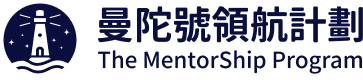
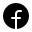
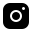
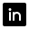
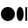

# The Mentorship Program Taiwan Official Website ⛴️

<p>
  <a href="https://opensource.twitter.dev/status/#active"></a>
  <a href="https://github.com/thementorship-tw/thementorship.tw/blob/main/LICENSE" target="blank"></a>
  <a href="https://github.com/thementorship-tw/thementorship.tw/stargazers" target="blank"></a>
  <a href="https://thementorship.tw" target="blank"></a>
</p>



## About The Mentorship Program

`The Mentorship Program` derives from the word `Mentorship`, symbolizing our journey where captains, navigators, and sailors sail together on the same ship, exchanging insights as we navigate through the vast ocean of career development. We are dedicated to fostering both horizontal and vertical interactions, providing opportunities for participants across different skill levels and functions - whether experienced professionals or newcomers - to step out of their comfort zones. For more information, please see [The Mentorship Program Official Website](https://thementorship.tw).

## Technical Overview

### Next.js + Sanity

We use Next.js for the frontend and Sanity for the headless CMS.

This project is forked from [sanity-template-nextjs-clean](https://github.com/sanity-io/sanity-template-nextjs-clean), A clean Next.js template with a native authoring experience.

### Key Features

- **Next.js 15 for Performance:** Leverage the power of Next.js 15 App Router for blazing-fast performance and SEO-friendly static sites.
- **Real-time Visual Editing:** Edit content live with Sanity's [Presentation Tool](https://www.sanity.io/docs/presentation) and see updates in real time.
- **Live Content:** The [Live Content API](https://www.sanity.io/live) allows you to deliver live, dynamic experiences to your users without the complexity and scalability challenges that typically come with building real-time functionality.
- **Customizable Pages with Drag-and-Drop:** Create and manage pages using a page builder with dynamic components and [Drag-and-Drop Visual Editing](https://www.sanity.io/visual-editing-for-structured-content).
- **Powerful Content Management:** Collaborate with team members in real-time, with fine-grained revision history.
- **AI-powered Media Support:** Auto-generate alt text with [Sanity AI Assist](https://www.sanity.io/ai-assist).
- **On-demand Publishing:** No waiting for rebuilds—new content is live instantly with Incremental Static Revalidation.
- **Easy Media Management:** [Integrated Unsplash support](https://www.sanity.io/plugins/sanity-plugin-asset-source-unsplash) for seamless media handling.

## Repository Structure

```
├── nextjs-app/       # Next.js frontend application
├── studio/           # Sanity Studio (Headless CMS)
```

## Development Guide

For the development guide for nextjs-app, please see [nextjs-app/README.md](nextjs-app/README.md).
For the development guide for studio, please see [studio/README.md](studio/README.md).

## Connect With Us

Join our community and stay updated:

<a href="https://www.facebook.com/thementorshiptaiwan" target="_blank">
  
</a>
<a href="https://www.instagram.com/thementorshiptaiwan/" target="_blank">
  
</a>
<a href="https://www.linkedin.com/company/the-mentorship-taiwan/posts" target="_blank">
  
</a>
<a href="https://thementorshiptaiwan.medium.com/" target="_blank">
  
</a>

## Deployment Partner

We are proudly deployed on [Zeabur](https://zeabur.com), a modern cloud platform that empowers product builders with seamless deployment experience and robust infrastructure support. As a platform that champions open source initiatives, Zeabur provides us with reliable hosting and excellent performance.

<a href="https://zeabur.com" target="_blank">
  
</a>

## License

This project is licensed under the MIT License - see the [LICENSE](LICENSE) file for details.

---

© 2025 The Mentorship Program Taiwan. All Rights Reserved.
